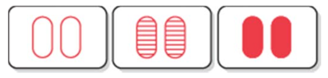
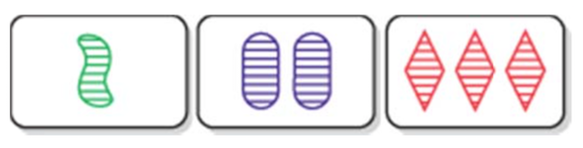

# SET Game
The goal of the SET game is to identify a SET of 3 cards from 12 cards choosed randomly from the 81 cards and placed face up on the table. Each card has four features, which can vary as follows:


A SET consists of 3 cards in which each of the card’s features, looked at one‐by‐one, are the same on each card, or, are different on each card. All of the features must separately satisfy this rule. In other words: shape must be either the same on all 3 cards, or different on each of the 3 cards; color must be either the same on all 3 cards, or different on each of the 3, etc. See EXAMPLES below.

## A quick check ‐ Is it a SET?
If 2 cards are the same and 1 card is different in any feature, then it is not a SET. For example, if 2 are red and 1 is purple then it is not a SET. A SET must be either all the same OR all different in each individual feature.

## Examples
For example, the following are SETs:

* All three cards have the **same shape**, the **same color**, the **same number** of symbols and they all have **different shading**.
  
* All three cards have **different shapes**, **different colors**, and **different numbers** of symbols and they all have the **same shading**.
  
* All three cards have **different shapes**, **different colors**, **different numbers** of symbols and **different shadings**.
  

## The play

1. The dealer shuffles the cards and lays 12 of them face up on the table (in a rectangle) so that they can be seen by all. 
2. Players identify and remove SETs of 3 cards from anywhere on the table. 
3. Each SET is checked by the other players.
4. If correct, the SET is kept by the player for one point and the dealer replaces the 3 cards with 3 from the deck. 
5. The SET must be picked up within a few seconds after calling it. If a player calls SET and does not have one, or if the SET is incorrect, he/she loses one point, and the 3 cards are returned to the table.
6. The play continues until the deck is depleted. At the end of the game there may be cards remaining that do not form a SET. The number of SETs held by each player is then counted. 

### Rules

* One point is given for each SET. High score wins.
* A player must call SET before picking up the cards. 
* There are no turns, the first player to call SET gets control of the board. 
* After he/she has called SET, no other player can pick up cards until that player has finished. 
* If all players agree that there is not a SET in the 12 cards, 3 more cards are laid face up on the table. The 3 cards are not replaced when the next SET is found, reducing the number back to 12. _Note_: There are ~ 33:1 odds that a SET is present in 12 cards, and ~ 2500:1 odds when 15 cards are on the table.
    
**Stunning Anecdote about the SET game** : 

[https://www.quantamagazine.org/20160531-set-proof-stuns-mathematicians](https://www.quantamagazine.org/20160531-set-proof-stuns-mathematicians)
> How big, one might wonder, is the largest collection of cards that contains no set? the answer is 20, proved in 1971 by the Italian mathematician Giuseppe Pellegrino. 

Recent math papers published in may 2016 defines an upper bound on how big a set can be with a variable number _n_ of attributes, leading to big advances in "polynomial method" field of mathematics. 

# The SET Game Kata

## Project setup
Have at least a JVM and Leiningen installed, then run:
`lein new reagent set-game +devcards`
then 
`lein figwheel`
then 
`lein figwheel devcards`

or simply run a repl within the Cursive IDE for instance.

## Instructions for the SET game domain logic

* **Choose a representation** for the characteristics of each card
* **Generate all the cards** from the combinations of the 4 different characteristics (colors, numbers, shadings and shapes), hence 3^4 or 81 cards.
* **Pick 12 cards** randomly forming a deck
* **Define a predicate function `set-of-cards?`** saying if three cards are forming a SET or not
* **Find the solutions** from the deck 12 cards

## A possible solution

Here is a solution for the Kata, using some brute force forming all the combinations C3/20 (hence 220) and checking if each one of those is a set or not. 

The code is in [src/cljc/set_game/logic.cljc](https://github.com/jgrodziski/set-game/blob/master/src/cljc/set_game/logic.clj). 

NB: `.cljc` suffix and source directory means the Clojure code in the file can either be run on the JVM or in a browser, hence is Clojure/ClojureScript compatible, `.cljs` means ClojureScript only and `.clj` Clojure only.

```clojure
(ns set-game.logic
  (:require [clojure.math.combinatorics :as combo]))

(def shapes  #{:oval :diamond :squiggle})
(def colors  #{:red :purple :green})
(def numbers #{:1 :2 :3})
(def shadings #{:solid :stripped :outline})

(def cards (-> (for [shape shapes
                     color colors
                     number numbers
                     shading shadings] [shape color number shading])
               shuffle
               set))

(def deck (take 12 cards))

(defn all-identical? [p1 p2 p3]
  (= p1 p2 p3))

(defn all-different? [p1 p2 p3]
  (= (count (set [p1 p2 p3])) 3))

(defn set-of-cards? [[[c1-shape c1-color c1-number c1-shading]
                      [c2-shape c2-color c2-number c2-shading]
                      [c3-shape c3-color c3-number c3-shading]]]
  (and
    (or (all-different? c1-shape c2-shape c3-shape) (all-identical? c1-shape c2-shape c3-shape))
    (or (all-different? c1-color c2-color c3-color) (all-identical? c1-color c2-color c3-color))
    (or (all-different? c1-number c2-number c3-number) (all-identical? c1-number c2-number c3-number))
    (or (all-different? c1-shading c2-shading c3-shading) (all-identical? c1-shading c2-shading c3-shading))))

(defn SETs [deck]
  (filter set-of-cards? (combo/combinations deck 3)))

```

**Beware the SET game is copyrighted! the content is here for educational purpose only.** 
>Copyright © 1998, 1991 Cannei, LLC. All rights reserved. SET® and all designated logos and slogans are registered trademarks of Cannei, LLC.


